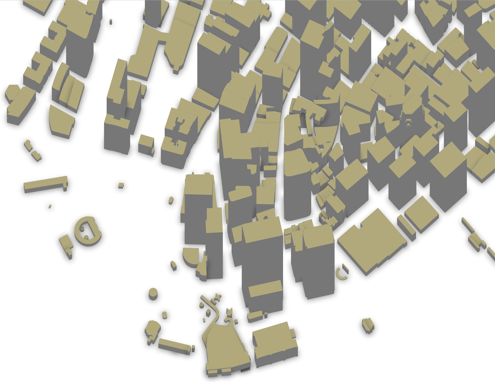

<a href="3dbuildings-manhatten.png"></a>
{:.flright}

*You need at least osm2pgsql version 1.7.0 for this example.*

For some buildings OSM data contains height information. Sometimes it is
specified directly in the
[`height`](https://taginfo.openstreetmap.org/keys/height) tag, usually in
meters. If not, we can have a look at the
[`building:levels`](https://taginfo.openstreetmap.org/keys/building:levels) tag
which sometimes contains the number of levels a building has. Assuming a level
is on average 4 meters high, we can estimate the building height from that.

In a real world application you'd have to look into more details of those and
other tags, the height is sometimes given in feet for instance. But for this
demo this simplified setup should suffice.

To get some nice sample data, lets look at New York. You can use the [Protomaps
download service](https://app.protomaps.com/) to get the extract.
Zoom to New York and draw a polygon around the tip of Manhattan, add the name
"newyork" and click on "Create Extract". In a few seconds you'll get a download
button to download a file `newyork.osm.pbf`.

Create a database `buildings` and import the data:

```sh
osm2pgsql -d buildings -O flex -S 3dbuildings.lua newyork.osm.pbf
```

You can visualize this with QGIS by adding the `buildings` layer as usual,
then choosing "2.5 D" as symbolization in the layers Symbology dialog. Choose
the "height" attribute in the "Height" dropdown and play around with the rest
of the settings.

Here is the configuration file you'll need:



```lua

```

