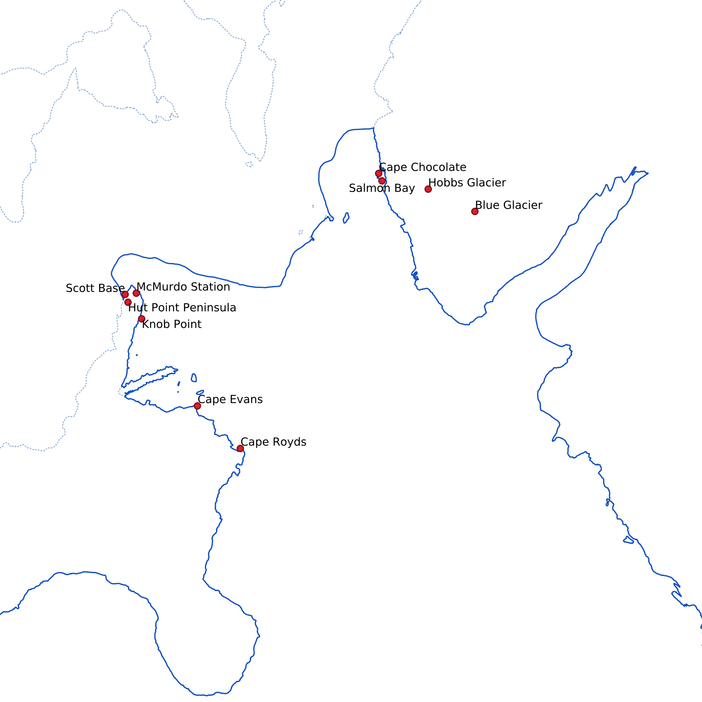
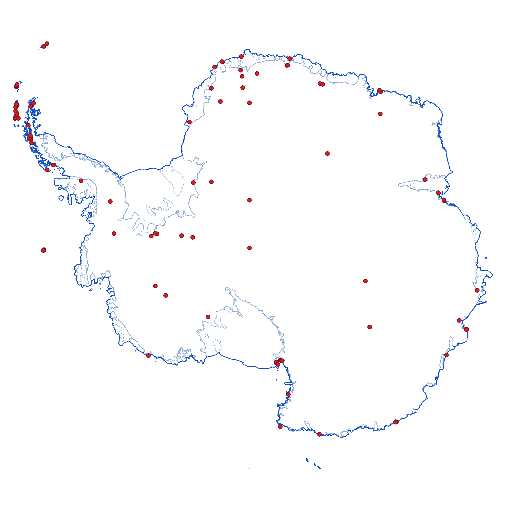

<a href="antarctica2.png"></a>

Typical maps on the web these days use the Mercator projection. And osm2pgsql
uses that as the default projection, too. But osm2pgsql can handle basically
any projection out there. It does this by leveraging the capabilities of the
[PROJ](https://proj.org/){:.extlink} library. (Osm2pgsql must be compiled with
PROJ support for this to work. This should be the case for most versions of
osm2pgsql you encounter.)

In this example we'll use an Antarctic polar [stereographic
projection](https://en.wikipedia.org/wiki/Stereographic_projection){:.extlink}
([EPSG 3031](https://epsg.io/3031){:.extlink}), a special projection suitable
for showing Antarctica.

## Getting and Preparing the Data

Getting the data needed is easy, because Geofabrik offers an Antarctica extract
for download:
[antarctica-latest.osm.pbf](https://download.geofabrik.de/antarctica-latest.osm.pbf){:.extlink}

## Running Osm2pgsql

OpenStreetMap contains data about coastlines, ice shelf boundaries as well as
research stations and other details in Antarctica. We use this here for a rough
outline of the continent and some red dots were stations and other important
features are. (See [the OSM
wiki](https://wiki.openstreetmap.org/wiki/Antarctica/Tagging){:.extlink} for
more information about special tags for Antarctica.)

As usual with OSM, the tagging is a bit inconsistent, some stations are tagged
with `place=hamlet` or `place=town`, others as `place=locality`. But some
glaciers are also tagged `place=locality`. This is certainly something that
could be improved in OSM data as well as the osm2pgsql config script, but
for our purposes here, this should be good enough.

Here is the style config. Note the `projection = 3031` option on all the tables
we define.



```lua

```

<a href="antarctica1.png"></a>
