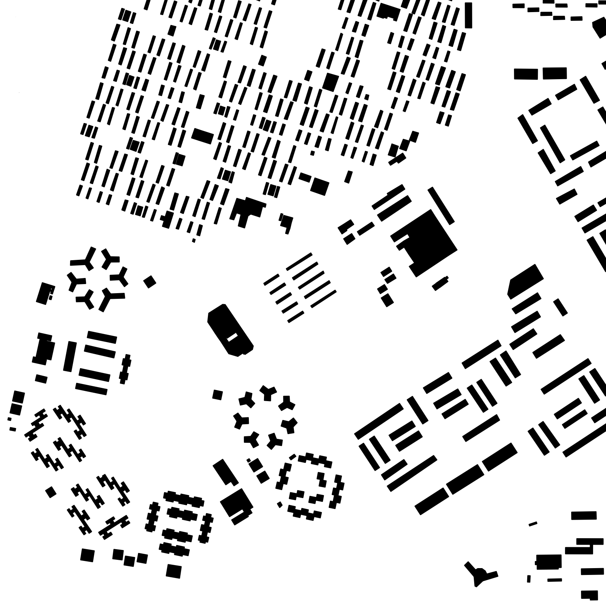
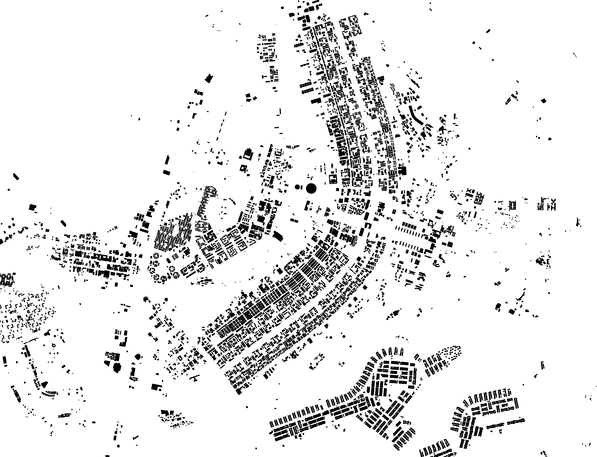

<a href="brasilia2.png"></a>
{:.flright}

*You need at least osm2pgsql version 1.7.0 for this example.*

You don't always have to load all the OSM data into the database to create
something useful (or beautiful). In this example we take the data from a city
and only load the building footprints into the database. The whole process only
takes a few seconds and we can show a pretty map.

As example city we are using
[Brasília](https://en.wikipedia.org/wiki/Bras%C3%ADlia) here, the capital of
Brazil. As I write this, it isn't fully mapped yet, some buildings are missing.
But the distinctive shape of this planned city shows up nevertheless.

## Getting and Preparing the Data

First, we need some data. The smallest extract available from the [Geofabrik
Download server](https://download.geofabrik.de/) containing the city is the
"centro-oeste" region. Lets download that:

```sh
wget https://download.geofabrik.de/south-america/brazil/centro-oeste-latest.osm.pbf
```

A quick search on the OSM web site find the [Distrito
Federal](https://www.openstreetmap.org/relation/421151) as a good boundary
of the area of interest. If we scroll down to the end of the box on the left
side of that page we find a link "Download XML". We get the URL from that
and add "/full" to the end. Downloading that gives use the relation containing
the boundary including all ways and nodes needed:

```sh
wget -O federal-district.osm https://www.openstreetmap.org/api/0.6/relation/421151/full
```

We can now use [Osmium](https://osmcode.org/osmium-tool/) to create an extract
containing only the data inside the Distrito Federal from the "centro-oeste"
region:

```sh
osmium extract -p federal-district.osm -o brasilia.osm.pbf centro-oeste-latest.osm.pbf
```

The result is the file `brasilia.osm.pbf` containing all OSM data for the
federal district.

## Running Osm2pgsql

Now we import this data into the database with osm2pgsql. First we need a
style file for the flex output that only imports the buildings. We need a
single table with a polygon geometry. Because we don't need any tags in the
database, we don't import them.



```lua

```

Now we load the data:

```sh
osm2pgsql -d mbuildings -O flex -S buildings.lua brasilia.osm.pbf
```

## Visualizing

There are many ways to visualize the data now. In this case I loaded the data
into [QGIS](https://qgis.org) which has excellent support for
PostgreSQL/PostGIS layers. After a few clicks loading the database table and
changing the style, I got this:

<a href="brasilia1.png"></a>

