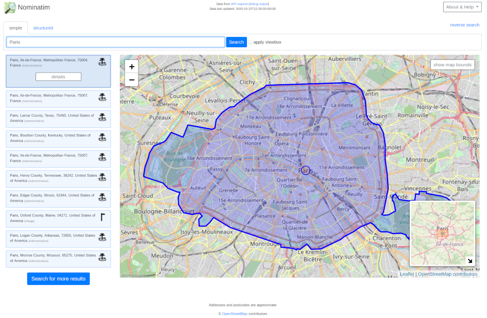

{:.flright}

[Nominatim](https://nominatim.org){:.extlink} uses OpenStreetMap data to find
locations on Earth by name and address (geocoding). It can also do the reverse,
find an address for any location on the planet.

Nominatim powers the geocoding on the official OSM site at
[openstreetmap.org](https://openstreetmap.org/). It serves 30 million queries
per day on a single server. And it is always kept up to date using osm2pgsql.

You can set up Nominatim [on your own
server](http://nominatim.org/release-docs/latest/admin/Installation/){:.extlink}.

