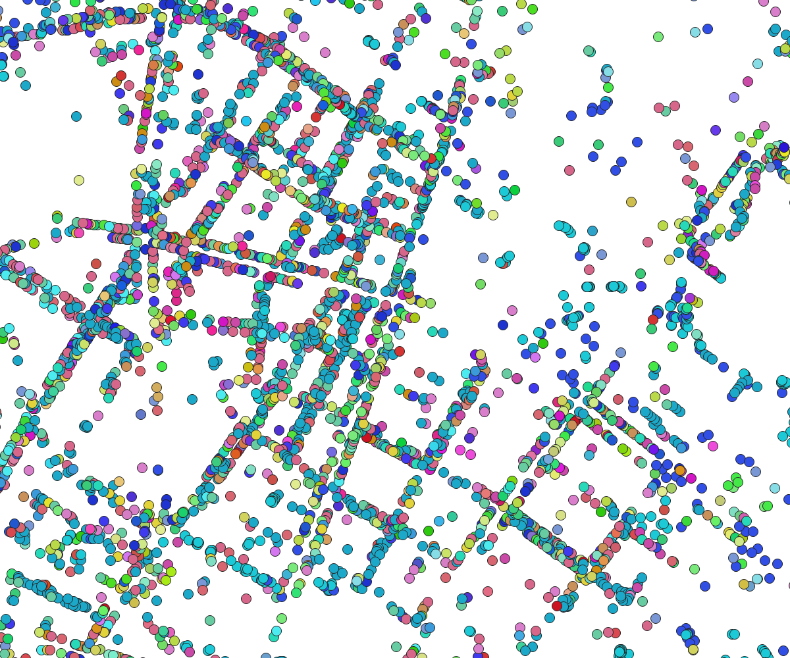

*You need at least osm2pgsql version 1.7.0 for this example.*

Points of Interest (POI) such as restaurants, shops, etc. can be mapped in OSM
in two different ways. Either as nodes, i. e. as a single point, or as closed
ways, usually with an additional `building` tag. When you want to show POIs on
the map you often don't need to render the buildings they are in, you just need
a single location where to put an icon.

With osm2pgsql this is easily done. Here is the Lua configuration:



```lua

```

<a href="pois-berlin.png"></a>
{:.flright}

We define a single table called `pois` with a point geometry column, a column
for the name of the POI and class and subclass columns for the type. Most
POIs will either have an `amenity` or a `shop` tag, the tag key will be written
to the `class` column of the table, the tag value to the `subclass` column.
You can extend this with other POI types or filter the data as needed.

For nodes we get the point geometry directly. For ways we get the polygon
geometry and calculate the centroid (center point) from it. If something
fails, because the way is not a valid polygon, the geometry will be null
and nothing is written to the database because of the `NOT NULL` declaration
of the geometry column.

To load the data, create a PostGIS database `pois` as usual and then run
osm2pgsql with some OSM data extract or the planet file:

```sh
osm2pgsql -d pois -O flex -S pois.lua input.osm.pbf
```

For the image on the right we used an extract of the city of Berlin using
different colored dots for the different types of POIs. In a real map you'll
probably use icons of course.

