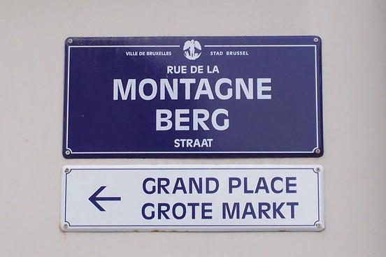

<a href="https://en.wikipedia.org/wiki/File:Brussels_signs.jpg"></a>

Of course osm2pgsql can also generate the data needed for creating vector
tiles. In this example we are looking at streets in Brussels. Belgium has
three official languages: Dutch, French, and German. Most people speak either
Dutch (Flemish) or French, so all streets in the Belgian capital have two
names.

For this use case we can create vector tiles that contain the names in both
languages. We add, as third option, the generic `name`, which in Brussels
contains both the French and the Dutch name. The resulting map can be switched
between languages without the overhead of getting new tiles from the server.
All the rendering happens in the browser.

To recreate this map you need the OSM data from Brussels. You can [download the
data for Belgium](https://download.geofabrik.de/europe/belgium.html){:.extlink}
and use [Osmium](https://osmcode.org/osmium-tool/){:.extlink} to cut out the
area:

```sh
osmium extract -b 4.29,50.815,4.47,50.90 /arc/geodata/osm/belgium-latest.osm.pbf -o brussels.osm.pbf
```

Then [create a database](/doc/manual.html#preparing-the-database) and import
with osm2pgsql:

```sh
osm2pgsql -d brussels -O flex -S streets.lua brussels.osm.pbf
```

Here is the Lua config file:



```lua

```

There are many ways how to serve the contents of a PostgreSQL/PostGIS database
as vector tiles. One of the easiest to set up is
[pg_tileserv](https://github.com/CrunchyData/pg_tileserv){:.extlink}. It
only needs the database connection info and will serve all geometry tables
it finds there as MVT tiles:

```sh
DATABASE_URL=postgresql:///brussels ./pg_tileserv
```

(For the demo map here we have dumped all tiles into a static file system, so
we don't need to run a database and tileserver.)

<label for="language">Choose language: </label>
<select name="language" id="language" onchange="lang_change()">
    <option value="generic">Generic</option>
    <option value="fr">French</option>
    <option value="nl">Dutch</option>
</select>

<div id="map" class="map"></div>
<script>

var current_lang = 'generic';

function lang_name() {
    if (current_lang == 'generic') {
        return 'name';
    }
    return 'name_' + current_lang;
}

var style_casing = new ol.style.Style({
    stroke: new ol.style.Stroke({
        color: 'black',
        width: 10,
    }),
    zIndex: 1,
});

var style_core = new ol.style.Style({
    stroke: new ol.style.Stroke({
        color: 'white',
        width: 9,
    }),
    zIndex: 2,
});

var style_text = new ol.style.Style({
    text: new ol.style.Text({
        font: '8px "sans-serif"',
        placement: 'line',
        offsetY: 0.5,
        fill: new ol.style.Fill({
            color: '#4040a0',
        }),
    }),
});

var layer =
    new ol.layer.VectorTile({
        declutter: true,
        source: new ol.source.VectorTile({
            attributions: ol.source.OSM.ATTRIBUTION,
            format: new ol.format.MVT(),
            url: 'tiles/{z}/{x}/{y}.pbf',
        }),
        style: function (feature) {
            style_text.getText().setText(feature.get(lang_name()));
            return [style_casing, style_core, style_text];
        },
    })

function lang_change() {
    current_lang = document.getElementById('language').value;
    layer.changed();
}

var map = new ol.Map({
    layers: [ layer ],
    target: 'map',
    view: new ol.View({
        minZoom: 16,
        maxZoom: 18,
        center: ol.proj.fromLonLat([4.39, 50.8477]),
        zoom: 16,
        extent: ol.proj.transformExtent([4.295, 50.82, 4.465, 50.89], 'EPSG:4326', 'EPSG:3857'),
    }),
});
</script>
