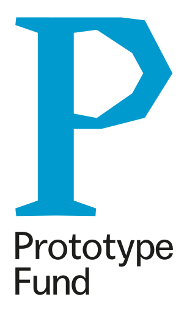
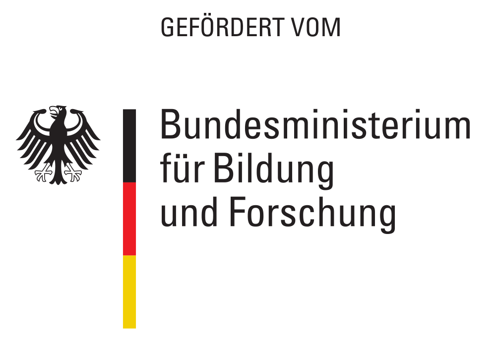

# Generalization

[*Cartographic
generalization*](https://en.wikipedia.org/wiki/Cartographic_generalization){:.extlink}
is the process turning detailed geographic data into more general data for
smaller zoom levels or smaller scale maps. It is essential for generating
good-looking, easy to interpret, and fast rendering small scale maps.

Currently osm2pgsql has almost no built-in support for generalization, usually
it is done using lots of SQL magic after the initial import of the data with
osm2pgsql. From September 2022 to February 2023 we are running a
[project](https://prototypefund.de/project/generalisierung-von-openstreetmap-daten-mit-osm2pgsql/){:.extlink}
funded by the [Prototype Fund](https://prototypefund.de/){:.extlink} and the
[German Federal Ministry of Education and
Research](https://www.bmbf.de/){:.extlink} to add more support for
generalization to osm2pgsql. This will include adding some generalization
support directly to osm2pgsql but also using the capabilities of the PostgreSQL
database and especially the PostGIS extension in a more easy to use fashion.

Here are the posts from Jochen's blog describing the progress of the project:

* [Generalization of OSM data](https://blog.jochentopf.com/2022-11-03-generalization-of-osm-data.html)
* [Selection of generalization problems](https://blog.jochentopf.com/2022-11-07-selection-of-generalization-problems.html)
* [Finding representative points for polygons](https://blog.jochentopf.com/2022-11-10-finding-representative-points-for-polygons.html)
* [Processing architecture for generalization in osm2pgsql](https://blog.jochentopf.com/2022-11-15-processing-architecture-for-generalization-in-osm2pgsql.html)
* [Generalizing polygons](https://blog.jochentopf.com/2022-11-21-generalizing-polygons.html)
* [PostgreSQL raster experiments](https://blog.jochentopf.com/2022-12-14-postgresql-raster-experiments.html)
* [Selecting settlements to display](https://blog.jochentopf.com/2022-12-19-selecting-settlements-to-display.html)

And here are some related pull requests:
* [PR 1822 (Pole of Inaccessibility)](https://github.com/openstreetmap/osm2pgsql/pull/1822)
* [PR 1830 (Polygon Generalization)](https://github.com/openstreetmap/osm2pgsql/pull/1830)

September 2022 bis Februar 2023 FKZ 01IS22S29

